# XAML Power Toys for Visual Studio 2017 - 2019

Download this extension from the [VS Gallery](https://visualstudiogallery.msdn.microsoft.com/2abb43bb-350b-4f2c-bc0f-a8262a0094d3)
or get the [CI build](http://vsixgallery.com/extension/d01c1624-8838-4097-bf77-f52d73fc7a1f/).

---------------------------------------

## Visual Studio 2017 Support - On Hold
I discovered a problem with the way references are resolved with the package on Visual Studio 2017.  I'm working with Microsoft to resolve the issue.

Visual Studio 2017 - 2019 extension that enables developers to rapidly generate data entry forms from view models or entity objects for Xamarin Forms, UWP, WPF, and Silverlight.

See the [changelog](CHANGELOG.md) for changes and roadmap.

## Pull Requests

Unfortunately, at this time, I don't have the cycles to work with Pull Requests.  If you require feature or run into an issue, please post an issue and I'll respond.  Thank you for your understanding.

## Training Videos

To get the most our of XAML Power Toys, and to create complex forms like the ones pictured below ***PLEASE*** take a few minutes and watch the training vidoes.

**Training Videos** on my blog [here](https://oceanware.wordpress.com/xaml-power-toys/)

##Xamarin Forms Primary Scenario##

At the writing of this, the primary scenario for Xamarin Forms is pages that don't require Platform specific features to accomplish the layout, navigation, animation, or functional implementation.

This tool is designed to enable the developer to rapidly create cross-platform data bound, data entry forms.

While adopting the MVVM pattern is not a requirement to create forms with the tool, it is designed to fully support creating forms with a view model as the BindingContext or DataContext. Using the MVVM pattern has long been a best practice for developing XAML applications, this tool's happy path is form development against view models.

The XAML that the tool generates, is similar to clean hand-coded XAML. Clean XAML is easily styleable because few if any Element properties have values set. 

## Features

- Rapid Data Entry Form Creation from View Model or Entity Class

### Rapid Data Entry Form Creation

**NOTE:** the below images and property names in this documentation, were taken from a Xamarin Forms application.  When using the tool for WPF, some options will not be displayed or different ones will be displayed.

Creating a data bound, data entry form with XAML Power Toys is very simple. You'll use drag and drop to specify the desired data form controls on a friendly layout surface.

The end result will be a data entry form that renders well across platforms, with all data bindings, format strings, etc. set the way you would had you hand coded the form.

**Easy Workflow**

* Start XAML Power Toys
* Select Source Class
* Optionally Set Form Options
* Drag and Drop Properties to Layout Surface
* Optionally Set Control Options
* Optionally Set Generate UI Options
* Generate UI

#### Start XAML Power Toys
From a XAML file in a Xamarin Forms or WPF project, right click in the editor where you want your form to be inserted.

**NOTE:** You must **build** your solution if you've made changes to any view model or entity class **BEFORE** opening XAML Power Toys. This tool uses reflection to load up your solution's view models and entity classes.

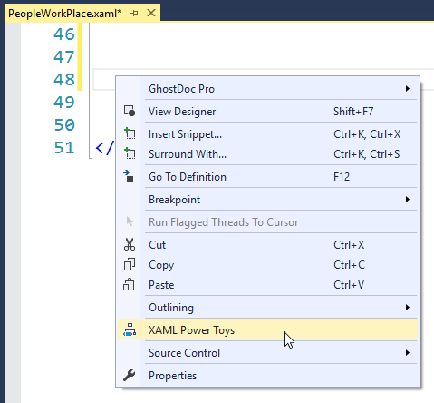

#### Select Source Class
Beginning with release 1.2.18, internal types are included in the listed classes from the same assembly as the XAML file you launched XAML Power Toys from.

After clicking the XAML Power Toys command in the context menu, the below Select Source Class dialog appears.

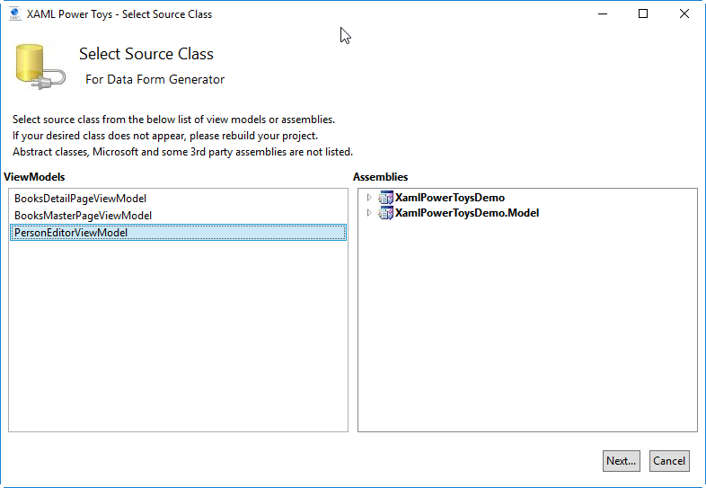

When the dialog opens: it loads the left list box will all classes where their name ends with ViewModel; case insensitive, and it loads up all classes by assembly, namespace, class name in the tree view on the right.

It attempts to locate a view model for the active XAML file by naming convention.  

If one is found, it will be selected in the ViewModels list box on the left and the Next... button will be enabled.

If one is not found by naming convention, the Next... button will be disabled until you selected either a view model from the ViewModels list box or a class from the Assemblies tree view.

After clicking the Next... button the XAML Power Toys Form Layout Tool dialog will appear.
#### Form Layout Tool
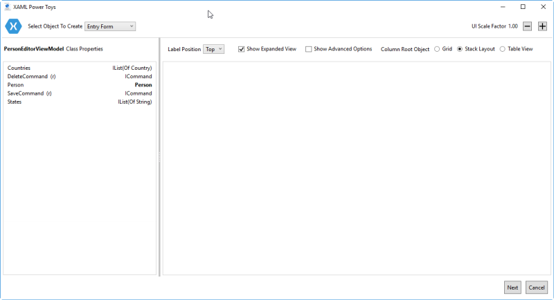

**Description**

* On the left:
  * The icon at the top indicates the platform this form is targeting.  In this case, Xamarin Forms.
  * The selected type name is displayed.  In this example **PersonEditorViewModel**.
  * Each of the selected type properties are displayed in the list box.
  * The (r) indicates a read-only property.
  * Below the class properties are a list of Unbound Controls that can be added to form.
* On the top:
  * Very top right are + and - buttons for zooming the tool in or out.
  * The rendered Label Position is set by selecting the position you want the form label to appear.
  * The Show Expanded View check box, will cause the items on the right side to expand or contract.
  * The Show Advanced Options check box, will cause the Advance Options to be displayed for each item.
  * The Column Root Object radio button group allows the developer to select the root control for the form.
  * The properties in **BOLD**, are drillable. To drill into a property, double click the **BOLD** name.
  * After drilling into a property, that class's properties will be displayed as pictured below.
  * To return to the parent class, click the black, back arrow icon.

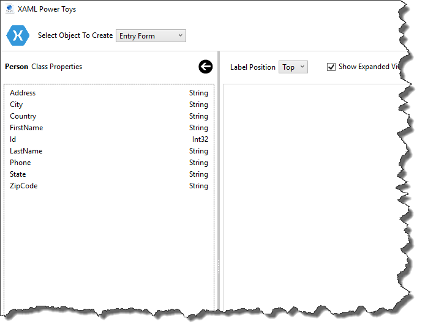

**Simple Usage**

* To add controls to your form, drag and drop a property from the list box to the layout surface.
* In the below image, I've dragged the FirstName and LastName properties to the layout surface:
  * The Path for the Entry control Text property is set to Person.FirstName.
  * The Control Label and Placeholder text have been defaulted by splitting the property name at each capital letter.
  * The Control has been defaulted based on the property data type.  You can change it if required for your application.
  * The Keyboard as been defaulted based on the property data type.  You can changed it if required for your application.
* You can reorder the controls by dragging them up or down in the layout surface.
* You can remove a control by dragging it back to the properties listing it was dragged from.

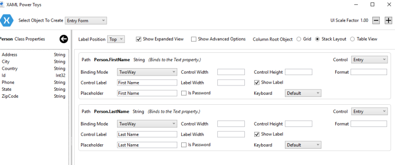

**Generate UI**
I'm now happy with my two field form. It will be rendered in a stack layout and have the control labels positioned above each control.

Click the Next... button and the XAML UI Generation Options are displayed.

You can optionally wrap the form in a top level control.  For example, a scroll viewer for mobile forms.

You can optionally add names to all your controls.

You can optionally add a form header to the generated UI.

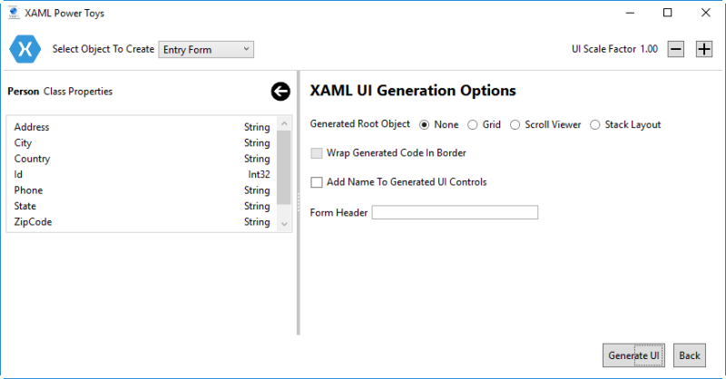

Click the Generate UI button and the following form will be inserted into your XAML file where you opened the context menu.

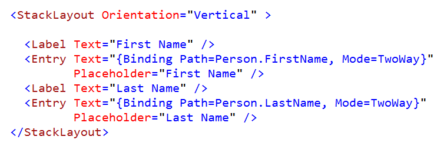

If run the Xamarin Forms UWP application, the UI looks like this:

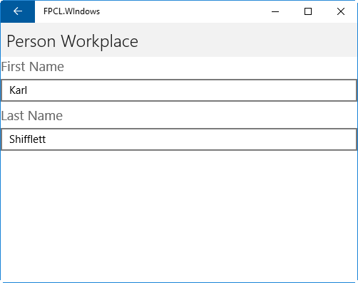

## Example Forms Created With XAML Power Toys
With a little styling, these forms would look great and took less than a minute to create each one.

| IOS TableView Form  | Country BindablePicker  |
|---|---|
| 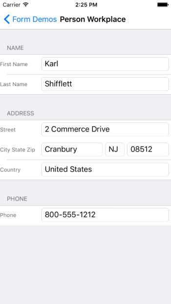  | 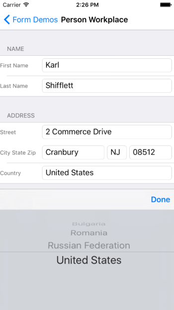  |

| IOS Form With Images  | Book Detail Form  |
|---|---|
| 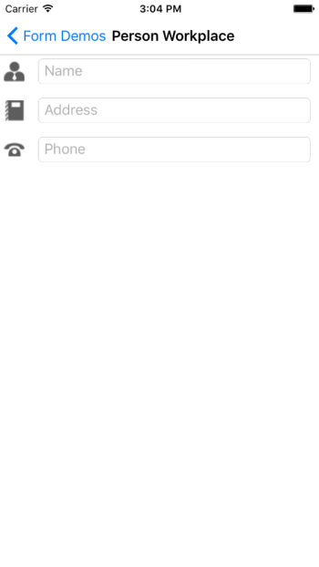  | 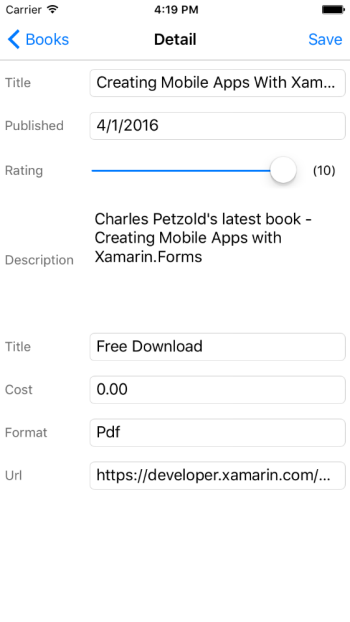  |

### How to create a form with City State Zip controls next to each other

Have a look at the above application sample images that have the City, State, and Zip on the same row.

The below image pictures the required settings to accomplish this.

**Table Section Title**

This form's Column Root Object is a Table View.  Table views group controls in sections.  In the below image, all fields are grouped in the "Address" section.

**City**

* Control Label is changed to City State Zip
* Include Next Control In Row is checked (this causes State to be placed next to City)
* Changed the Row Item Width to * (star)

**State**

* Show Label is unchecked (prevents the label from being rendered)
* Include Next Control In Row is checked  (this causes Zip to be placed next to State)
* Left Row Item Width to Auto, you could also specify a numeric control width

**State**

* Show Label is unchecked (prevents the label from being rendered)
* Set the Row Item Width to Auto, you could also specify a numeric control width

**BindablePicker**

The BindablePicker control is one I created and blogged about [here](https://oceanware.wordpress.com/2016/08/12/xamarin-forms-bindable-picker-v2/)

You can also get it and see many examples in the Xamarin Forms Bindable Picker repo [here](https://github.com/Oceanware/XamarinFormsBindablePicker)

You can see two of the supported scenarios:  

* States is bound to a list of Strings
* Countries is bound to a list of Country objects. Notice for Country, the DisplayMemberPath and SelectedValuePath are both set.

The States and Countries collections are exposed on the view model, making the task of setting up data bindings trivial.

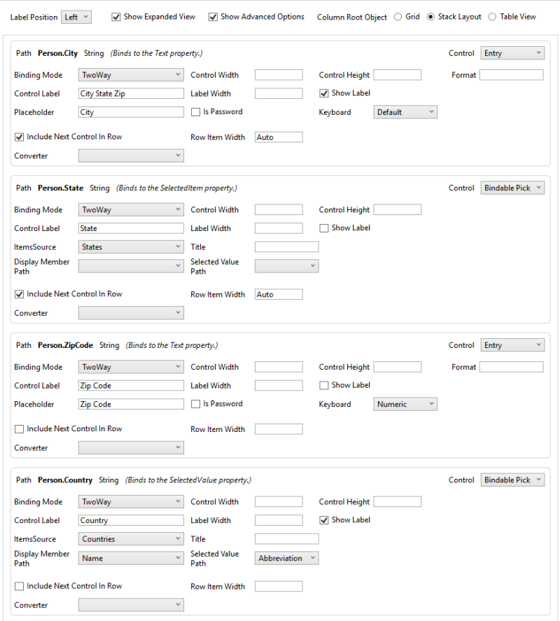

## Clone and Build

For cloning and building this project yourself, make sure
to install the
[Extensibility Tools 2019](https://marketplace.visualstudio.com/items?itemName=MadsKristensen.ExtensibilityEssentials2019)
extension for Visual Studio which enables some features
used by this project.

## License
[Apache 2.0](LICENSE)